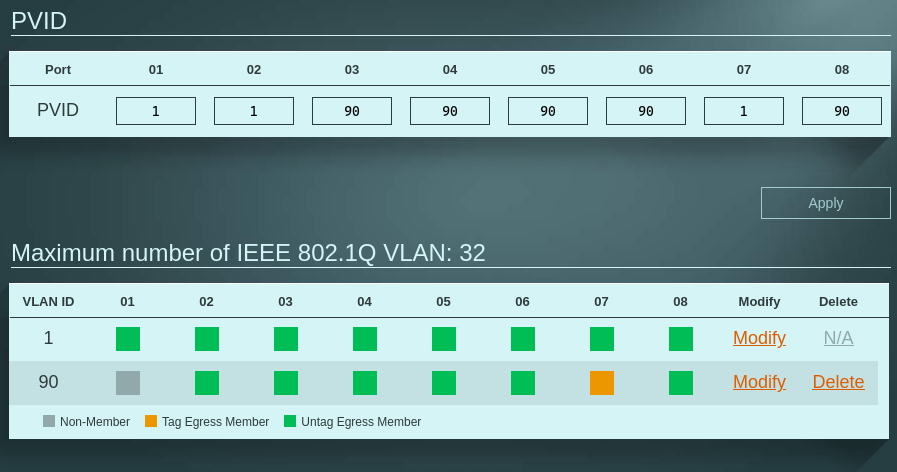

# homelab
Homelab Stuff

## Notlar

### Zabbix Agent Role

- zabbix-agent dosyasında ki bu kısmı kendi zabbix server ip adresinizle değiştirmeyi unutmayın.
```bash

  vars:
    zabbix_server_ip: "192.168.1.11"
```

#  Homelab Topology

 
#  Homelab Topology

 